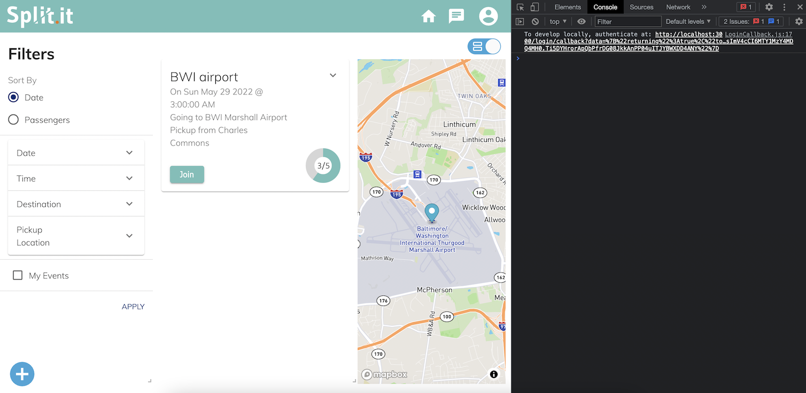
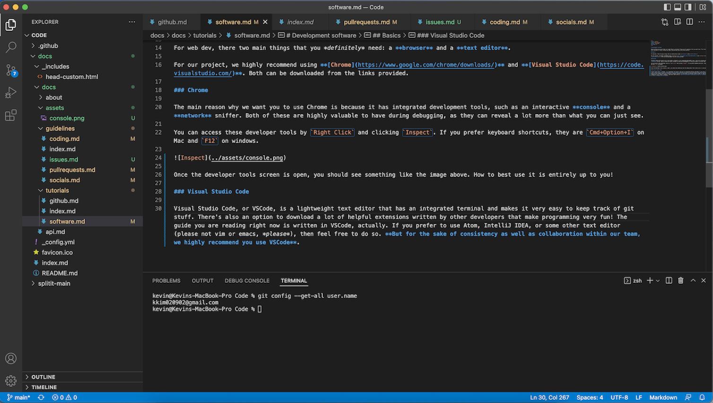

# Development software

Which software do we use? What do I need? Which is the best? These are all questions that you might have. This tutorial will provide you with the basics of what software you need, and anything fancy you can do yourself.

## Basics

For web dev, there two main things that you *definitely* need: a **browser** and a **text editor**.

For our project, we highly recommend using **[Chrome](https://www.google.com/chrome/downloads/)** and **[Visual Studio Code](https://code.visualstudio.com/)**. Both can be downloaded from the links provided.

### Chrome

The main reason why we want you to use Chrome is because it has integrated development tools, such as an interactive **console** and a **network** sniffer. Both of these are highly valuable to have during debugging, as they can reveal a lot more than what you can just see.

You can access these developer tools by `Right Click` and clicking `Inspect`. If you prefer keyboard shortcuts, they are `Cmd+Option+I` on Mac and `F12` on windows.

Once the developer tools screen is open, you should see something like the image above. How to best use it is entirely up to you!

### Visual Studio Code

Visual Studio Code, or VSCode, is a lightweight text editor that has an integrated terminal and makes it very easy to keep track of git stuff. There's also an option to download a lot of helpful extensions written by other developers that make programming very fun! The guide you are reading right now is written in VSCode, actually. If you prefer to use Atom, IntelliJ IDEA, or some other text editor (please not vim or emacs, *please*), then feel free to do so. **But for the sake of consistency as well as collaboration within our team, we highly recommend you use VSCode**.

## Other software

Depending on the work you are doing, you may also require other software. iOS development, for example, needs to happen in other environments. Backend people need other software to test their endpoints. Whatever it is, there are other things that just help our process dramatically.

### React Developer Tools

React Developer Tools is a Chrome DevTools extension for the open-source React JavaScript library. It allows you to inspect the React component hierarchies in the Chrome Developer Tools.  It is very useful for frontend development to manage component styling.

### Postman

*Page still under construction.*
