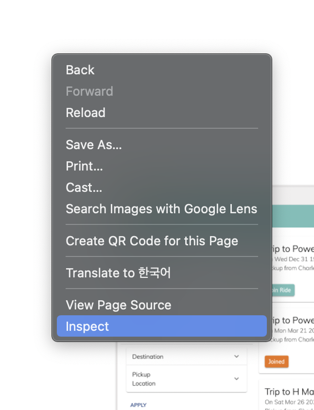

# Development software

Which software do we use? What do I need? Which is the best? These are all questions that you might have. This tutorial will provide you with the basics of what software you need, and anything fancy you can do yourself.

## Basics

For web dev, there two main things that you *definitely* need: a **browser** and a **text editor**.

For our project, we highly recommend using **[Chrome](https://www.google.com/chrome/downloads/)** and **[Visual Studio Code](https://code.visualstudio.com/)**. Both can be downloaded from the links provided.

### Chrome

The main reason why we want you to use Chrome is because it has integrated development tools, such as an interactive **console** and a **network** sniffer. Both of these are highly valuable to have during debugging, as they can reveal a lot more than what you can just see.

You can access these developer tools by `Right Click` and clicking `Inspect`. If you prefer keyboard shortcuts, they are `Cmd+Option+I` on Mac and `F12` on windows.

